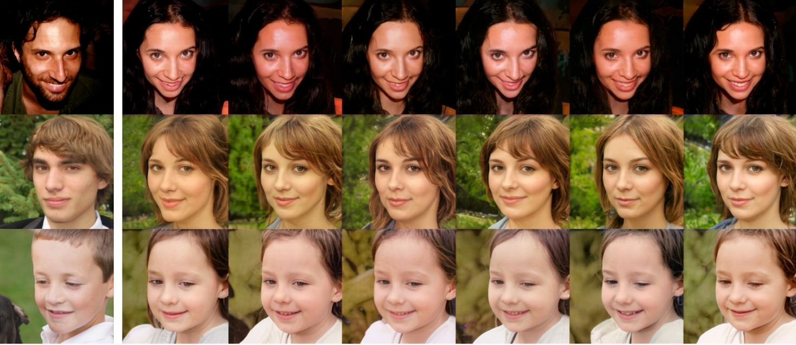

# Variational Entropic Optimal Transport

[](https://arxiv.org/abs/2602.02241)
[](https://openreview.net/forum?id=DgRd1uu8dj)
[](https://www.python.org/)
[](https://pytorch.org/)
[](LICENSE)

This repository contains the PyTorch code to reproduce the experiments from work Variational Entropic Optimal Transport (paper on [arxiv](https://arxiv.org/abs/2602.02241) and [OpenReview](https://openreview.net/forum?id=DgRd1uu8dj)) by [Roman Dyachenko](https://scholar.google.ru/citations?user=LGLfmFEAAAAJ&hl=en), [Nikita Gushchin](https://scholar.google.ru/citations?user=UaRTbNoAAAAJ&hl=en), [Kirill Sokolov](https://scholar.google.com/citations?user=etQbnJcAAAAJ&hl=en), [Petr Mokrov](https://scholar.google.com/citations?user=CRsi4IkAAAAJ&hl=en), [Evgeny Burnaev](https://scholar.google.ru/citations?user=pCRdcOwAAAAJ&hl=en) and [Alexander Korotin](https://scholar.google.ru/citations?user=1rIIvjAAAAAJ&hl=en).

<p align="center">
  
  <br>
  <em>An example: Unpaired Male &rarr; Female translation by our VarEOT solver applied in the latent space of ALAE for 1024&times;1024 FFHQ images.</em>
</p>

## Abstract

Entropic optimal transport (EOT) in continuous spaces with quadratic cost is a classical tool for solving the domain translation problem. In practice, recent approaches optimize a weak dual EOT objective depending on a single potential, but doing so is computationally not efficient due to the intractable log-partition term. Existing methods typically resolve this obstacle in one of two ways: by significantly restricting the transport family to obtain closed-form normalization (via Gaussian-mixture parameterizations), or by using general neural parameterizations that require simulation-based training procedures. We propose **Variational Entropic Optimal Transport (VarEOT)**, based on an exact variational reformulation of the log-partition $\log \mathbb{E}[\exp(\cdot)]$ as a tractable minimization over an auxiliary positive normalizer. This yields a differentiable learning objective optimized with stochastic gradients and avoids the necessity of MCMC simulations during the training. We provide theoretical guarantees, including finite-sample generalization bounds and approximation results under universal function approximation. Experiments on synthetic data and unpaired image-to-image translation demonstrate competitive or improved translation quality, while comparisons within the solvers that use the same weak dual EOT objective support the benefit of the proposed optimization principle.

## Repository structure:

```ALAE``` - Code for the ALAE model.

```notebooks/VarEOT_swiss_roll.ipynb``` - Code for swiss roll experiments.

```notebooks/VarEOT_alae.ipynb``` - Code for image experiments with ALAE.

```notebooks/VarEOT_MSCI.ipynb``` - Code for single cell experiments with MSCI.


## Setup

To run the notebooks, it is recommended to create a virtual environment using either [`conda`](https://conda.io/projects/conda/en/latest/user-guide/tasks/manage-environments.html#creating-an-environment-with-commands) or [`venv`](https://docs.python.org/3/library/venv.html). Once the virtual environment is set up, install the required dependencies by running the following command:

```console
pip install -r requirements.txt
```

Finally, make sure to install `torch` and `torchvision`. It is advisable to install these packages based on your system and `CUDA` version. Please refer to the [official website](https://pytorch.org) for detailed installation instructions.

## Citation
```
```

## Datasets

- **[FFHQ](https://github.com/nvlabs/ffhq-dataset)** — used for the ALAE unpaired image-to-image setup. We do **not** operate on raw 1024×1024 images: VarEOT is trained directly in the ALAE latent space, so the only inputs the solver needs are pre-computed latents (`data/latents.npy`) together with the `gender.npy` / `age.npy` attribute labels and `test_images.npy` for visualization. Download links and preparation steps are provided inside [`notebooks/VarEOT_alae.ipynb`](notebooks/VarEOT_alae.ipynb).
- **[MSCI](https://www.kaggle.com/competitions/open-problems-multimodal)** — Multimodal Single-Cell Integration dataset. We follow the preprocessing setup from the [LightSB](https://github.com/ngushchin/LightSB) paper: cells are projected onto the top principal components (PCA), and trajectory inference is performed across day pairs in this reduced space. Expected files in `data/` are of the form `full_cite_pcas_{DIM}_day_{D}.npy`, where `DIM ∈ {50, 100, 1000}` is the PCA dimensionality and `D ∈ {2, 3, 4, 7}` is the measurement day.


## Related repositories
- [Repository](https://github.com/PetrMokrov/Energy-guided-Entropic-OT) for [EgNOT](https://openreview.net/forum?id=d6tUsZeVs7) paper (ICLR 2024).
- [Repository](https://github.com/ngushchin/LightSB) for [LightSB](https://arxiv.org/abs/2310.01174) paper (ICLR 2024).

## License

This project is released under the MIT License — see the [LICENSE](LICENSE) file for details. Note that the `ALAE/` subdirectory is a fork of the original [ALAE repository](https://github.com/podgorskiy/ALAE) and retains its own license terms.
